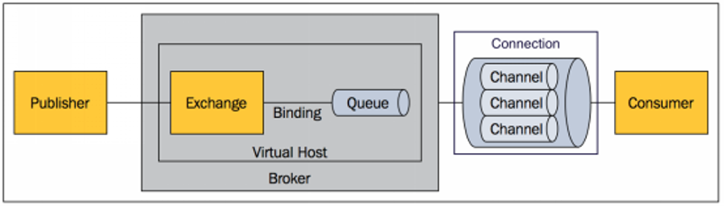
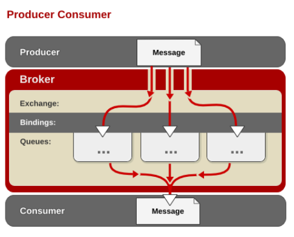
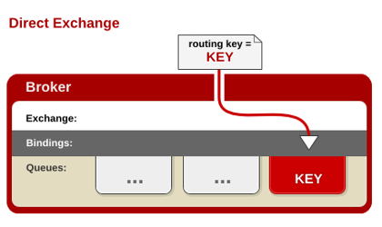
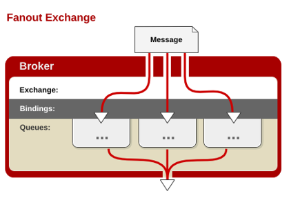
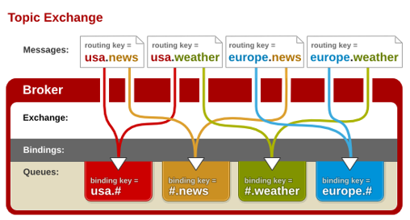

# RabbitMQ

## 一、RabbitMQ入门

### 1、RabbitMQ核心概念

> RabbitMQ是erlang语言开发的AMQP（advanced message queuing protocol）的开源实现。



* **Message：**消息，消息是不具名的，它由`消息头`和`消息体`组成。消息体是不透明的，而消息头则由一系列的可选属性组成，这些属性包括**routing-key（路由键）**、priority（相对于其他消息的优先权）、delivery-mode（指出该消息可能需要持久性存储）等。

* **Publisher：**消息的生产者，也是一个向交换器发布消息的客户端应用程序。

* **Broker/Server：**消息代理，表示消息代理的服务器实体

* **Virtual Host：**虚拟主机，表示一批交换器、消息队列和相关对象。虚拟主机是共享相同的身份认证和加密环境的独立服务器域。每个vhost 本质上就是一个 mini 版的 RabbitMQ 服务器，拥有自己的队列、交换器、绑定和权限机制。vhost 是 AMQP 概念的基础，必须在连接时指定，RabbitMQ 默认的 vhost 是 / 。

* **Exchange：**交换器，用来接收生产者发送的消息并将这些消息路由给服务器中的队列。Exchange有4种类型：direct(默认)，fanout, topic, 和headers，不同类型的Exchange转发消息的策略有所区别

* **Queue：**消息队列，用来保存消息直到发送给消费者。它是消息的容器，也是消息的终点。一个消息可投入一个或多个队列。消息一直在队列里面，等待消费者连接到这个队列将其取走。

* **Binding：**绑定，用于消息队列和交换器之间的关联。一个绑定就是基于路由键将交换器和消息队列连接起来的路由规则，所以可以将交换器理解成一个由绑定构成的路由表。Exchange 和Queue的绑定可以是多对多的关系。

* **Connection：**网络连接，比如一个TCP连接。

* **Channel：**信道，多路复用连接中的一条独立的双向数据流通道。信道是建立在真实的TCP连接内的虚拟连接，AMQP 命令都是通过信道发出去的，不管是发布消息、订阅队列还是接收消息，这些动作都是通过信道完成。因为对于操作系统来说建立和销毁TCP 都是非常昂贵的开销，所以引入了信道的概念，以复用一条 TCP 连接。
  
* **Consumer：**消息的消费者，表示一个从消息队列中取得消息的客户端应用程序。

  

### 2、RabbitMQ运行机制

#### 1、AMQP中的消息路由

AMQP 中消息的路由过程和 Java 开发者熟悉的 JMS 存在一些差别，AMQP 中增加了 ==**Exchange**== 和 **==Binding==** 的角色。生产者把消息发布到 Exchange 上，消息最终到达队列并被消费者接收，而 Binding 决定交换器的消息应该发送到那个队列。



#### 2、Exchange类型

**Exchange**分发消息时根据类型的不同分发策略有区别，目前共四种类型：==direct、fanout、topic==**、**headers** 。headers 匹配 AMQP 消息的 header 而不是路由键， headers 交换器和 direct 交换器完全一致，但性能差很多，目前几乎用不到了，所以直接看另外三种类型：

* direct:完全匹配、单播的模式。

> ==消息中的路由键（routing key）==如果和 ==Binding 中的 binding key== 一致，交换器就将消息发到对应的队列中。路由键与队列名完全匹配，==如果一个队列绑定到交换机要求路由键为“dog”，==则只转发 routing key 标记为“dog”的消息，不会转发“dog.puppy”，也不会转发“dog.guard”等等。



* fanout:匹配任意、广播模式。

> 每个发到 fanout 类型交换器的消息都会分到所有绑定的队列上去。fanout交换器不处理路由键，只是简单的将队列绑定到交换器上，每个发送到交换器的消息都会被转发到与该交换器绑定的所有队列上。很像子网广播，每台子网内的主机都获得了一份复制的消息。fanout类型转发消息是最快的。



* topic

> topic交换器通过模式匹配分配消息的路由键属性，将路由键和某个模式进行匹配，==此时队列需要绑定到一个模式上。它将路由键和绑定键的字符串切分成单词==，这些**单词之间用点隔开**。它同样也会识别两个通配符：符号“#”和符号*。#匹配0个或多个单词，*匹配一个单词。



* 总结：

direct类型要求==queue上的routing key（交换机绑定队列时Exchange binding queue，在队列上设置的绑定规则）==与==Publish message上携带的routing key==完全匹配。

fanout类型对queue上的routing key没有要求，广播匹配所有。

topic类型对queue上的routing key有特殊的要求，见 [topic](#topic)。

### 3、RabbitMQ安装

> [RabbitMQ官网](https://www.rabbitmq.com/install-rpm.html)
>
>  ...Yum repositories on [Package Cloud](https://www.rabbitmq.com/install-rpm.html#package-cloud) or [Bintray](https://www.rabbitmq.com/install-rpm.html#bintray) (this option is highly recommended)

* 安装erlang仓库

```shell
curl -s https://packagecloud.io/install/repositories/rabbitmq/erlang/script.rpm.sh | sudo bash
```

及安装包

```shell
sudo yum install erlang-21.3.8.6-1.el7.x86_64
```

* 安装rabbitmq-server仓库

```shell
curl -s https://packagecloud.io/install/repositories/rabbitmq/rabbitmq-server/script.rpm.sh | sudo bash
```

及安装包

```shell
sudo yum install rabbitmq-server-3.7.17-1.el7.noarch
```

* 修改配置文件

```shell
vi /usr/lib/rabbitmq/lib/rabbitmq_server-3.7.17/ebin/rabbit.app
```

* 安装ui管理界面

```shell
rabbitmq-plugins enable rabbitmq_management
```

* 开放15672端口、重启防火墙、访问对应的端口

### 4、RabbitMQ与SpringBoot整合

1、在pom.xml文件中引入依赖

2、在application.yml文件中配置rabbitmq的主机地址。

* 对应的属性配置在`RabbitProperties`中查看

3、引入配置后，在主配置类中使用@EnableRabbit注解开启RabbitMQ消息队列。

​	`这里和redis中，使用@EnableCaching开启缓存类似`

4、利用@RabbitListener注解监听具体的方法。

​	`在redis中，我们使用@Cacheable/@CachePut/@CacheEvict注解`

5、可以通过AmqpAdmin和RabbitTemplate操作rabbitmq，这两个类都在`RabbitAutoConfiguration`中可以找到。

- RabbitTemplate，可以用来进行消息的接收和发送。。。（对应redisTemplate）
- AmqpAdmin，用于管理组键，通过代码管理相应的exchange、queue、binding。。。

==貌似springboot中整合、使用各种中间件规律都很像？？==


> 以下内容根据慕课网——[RabbitMQ消息中间件技术精讲](https://coding.imooc.com/class/262.html)

## 二、RabbitMQ高级特性

### 1、保障100%消息投递成功设计方案

* 方案一：消息信心落库，对消息进行打标。


* 方案二：延迟投递


### 2、幂等性概念

一次请求或者多次请求的的结果，对资源本身的结果都是相同的。

消费段实现幂等性，就意味着，消息不会被重复多次消费，即使我们收到了多条消息。

**业界主要的幂等性操作：**

* 唯一id + 指纹锁 机制，利用数据库主键去重
* 利用redis的原子性取实现
  * 我们要进行数据落库，如果落库的话，如何保证数据库和缓存做到原子性
  * 如果不进行落库，如何设置定时同步的策略

### 3、Confirm确认消息API

> 第一步：在channel上开启确认模式：channel.confirmSelect()。
>
> 第二步：在channel上添加监听：addConfirmListerner，根据结果返回相应数据。

* SendConfirm.java

```java
public static void main(String[] args) throws Exception{
    //1 创建ConnectionFactory
    ConnectionFactory connectionFactory = new ConnectionFactory();
    connectionFactory.setHost("192.168.36.111");
    connectionFactory.setPort(5672);
    connectionFactory.setVirtualHost("/");

    //2 获取Connection
    Connection connection = connectionFactory.newConnection();

    //3 新建一个Channel
    Channel channel = connection.createChannel();

    //4 指定消息投递模式
    channel.confirmSelect();

    String exchange = "test_confirm_exchange";
    String routingKey = "test.confirm";
    String msg = "hello world by confirm";

    //5 发送消息
    channel.basicPublish(exchange, routingKey, null, msg.getBytes());

    //6 添加消息监听
    channel.addConfirmListener(new ConfirmListener() {
        @Override
        public void handleAck(long deliveryTag, boolean multiple) throws IOException {
            System.out.println("success");
        }

        @Override
        public void handleNack(long deliveryTag, boolean multiple) throws IOException {
            System.out.println("error");
        }
    });
}
```

* RecvConfirm.java

```java
public static void main(String[] args) throws Exception{
    //1 创建ConnectionFactory
    ConnectionFactory connectionFactory = new ConnectionFactory();
    connectionFactory.setHost("192.168.36.111");
    connectionFactory.setPort(5672);
    connectionFactory.setVirtualHost("/");

    //2 获取Connection
    Connection connection = connectionFactory.newConnection();

    //3 新建一个Channel
    Channel channel = connection.createChannel();

    String exchangeName = "test_confirm_exchange";
    String queueName = "test_confirm_queue";
    String routingKey = "test.#";

    channel.exchangeDeclare(exchangeName, "topic", true);
    channel.queueDeclare(queueName, true, false, false, null);
    channel.queueBind(queueName, exchangeName, routingKey);

    //5 创建消费者
    DeliverCallback deliverCallback = (consumerTag, delivery) -> {
        String message = new String(delivery.getBody(), "UTF-8");
        System.out.println(" [x] Received '" + message + "'");
    };
    channel.basicConsume(queueName, true, deliverCallback, consumerTag -> { });
}
```


### 4、Return返回消息API

> ```java
> channel.basicPublish(exchange, routingKey, mandotory, props, msg.getBytes());
> ```
>
> 关键配置项：Mandotory，默认为false；如果为true，则监听器会接收到路由不可达的消息，然后经行后续处理。

```java
channel.addReturnListener(new ReturnListener() {
    @Override
    public void handleReturn(int replyCode, String replyText, String exchange, String routingKey, AMQP.BasicProperties properties, byte[] body) throws IOException {

    }
});
```

### 5、自定义消费者API

根据自定义的消费者接收消息

```java
channel.basicConsume(queueName, true, new MyConsumer(channel));
```

* MyConsumer.java

```shell
public class MyConsumer extends DefaultConsumer {
    public MyConsumer(Channel channel) {
        super(channel);
    }

    @Override
    public void handleDelivery(String consumerTag, Envelope envelope, AMQP.BasicProperties properties, byte[] body) throws IOException {

    }
}
```

### 6、消费端限流

> 如果我们rabbitmq服务器上有上万条数据未处理，我们谁便打开一个客户端：巨量的消息就会全部推送过来，我们无法同时处理这么多数据。这就需要我们采用消费段限流。

rabbitmq提供qos（quality of service服务质量）功能，在非自动确认消息的前提下，如果一定数目的消息（基于consume或者channel设置qos的值）没有被确认，不进行消费新的消息。

```java
void basicQos(int prefetchSize, int prefetchCount, boolean global)
    
# prefetchSize：maximum amount of content (measured in octets) that the server will deliver, 0 if unlimited 设置为0，
# prefetchCount：maximum number of messages that the server will deliver, 0 if unlimited 设置为具体数量，例如：1
# global：true if the settings should be applied to the entire channel rather than each consumer 设置为false
```

其中：prefetchSize、global两个参数，rabbitmq没有实现，不考虑。**prefetchCount只有在自动应答关闭的情况下才生效**。

* Consume.java

```java
channel.basicQos(0, 1, false);

# true if the server should consider messages acknowledged once delivered;
# false if the server should expect explicit acknowledgements
# autoAck = false
channel.basicConsume(queueName, false, new MyConsumer(channel));
```

* MyConsumer.java

```java
public class MyConsumer extends DefaultConsumer {

    private Channel channel;

    public MyConsumer(Channel channel) {
        super(channel);
        this.channel = channel;
    }

    @Override
    public void handleDelivery(String consumerTag, Envelope envelope, AMQP.BasicProperties properties, byte[] body) throws IOException {
        channel.basicAck(envelope.getDeliveryTag(), false);
    }
}
```

### 7、消费端ACK与重回队列机制

```java
basicNack(long deliveryTag, boolean multiple, boolean requeue);
# true if the rejected message(s) should be requeued rather than discarded/dead-lettered
```

* MyConsumer.java

```java
public class MyConsumer extends DefaultConsumer {

    @Override
    public void handleDelivery(String consumerTag, Envelope envelope, AMQP.BasicProperties properties, byte[] body) throws IOException {
        if(){
            channel.basicNack(envelope.getDeliveryTag(), false, true);
        } else{
           	channel.basicAck(envelope.getDeliveryTag(), false);
        }
        
    }
}
```

### 8、TTL队列/消息

TTL是Time To Live的缩写，也就是生存时间。

具体有两种方式设置：

* 在消息发送时可以指定过期时间

```java
AMQP.BasicProperties properties = new AMQP.BasicProperties().builder()
    .expiration("10000")
    .build();
//5 发送消息
channel.basicPublish(exchange, routingKey, properties, msg.getBytes());
```

* 在队列上设置超时时间，具体时间从消息入队列开始计算，超时自动消除

```java
//添加arguments参数
Map<String, Object> arguments = new HashMap<>();
arguments.put("x-dead-message-ttl", number);
channel.queueDeclare(queueName, true, false, false, arguments);
```

### 8、死信队列

> DLX，是Dead-Letter-Exchange的缩写，也就是死信队列的意思。通过在队列上添加`x-dead-letter-exchange`参数，注明该队列是死信队列。而为什么英文名命名为Dead-Letter-Exchange，个人理解是：`消息成为死信后，该队列需要将该消息分发到另外的交换机上，充当的角色相当于一个exchange。`

**消息变成死信有一下集中情况：**消息被拒绝（basic.reject/basic.neck）并且requeue=false、消息TTL过期、队列达到最大长度

```java
// dlx相关参数
String dlxExchangeName = "dlx_exchange";
String dlxQueueName = "dlx_queue";
String dlxRoutingKey = "dlx.#";
// 用于处理死信的新队列
String exchangeName = "deal_dlx_exchange";
String queueName = "deal_dlx_queue";
String routingKey = "#";

channel.exchangeDeclare(dlxExchangeName, "topic", true);
// 添加arguments参数
Map<String, Object> arguments = new HashMap<>();
arguments.put("x-dead-letter-exchange", dlxExchangeName);
// DLX队列
channel.queueDeclare(dlxQueueName, true, false, false, arguments);
channel.queueBind(dlxQueueName, dlxExchangeName, dlxRoutingKey);

// 新队列
channel.exchangeDeclare(exchangeName, "topic", true);
channel.queueDeclare(queueName, true, false, false, null);
channel.queueBind(queueName, exchangeName, routingKey);
```


## 三、整合RabbitMQ与SpringBoot


