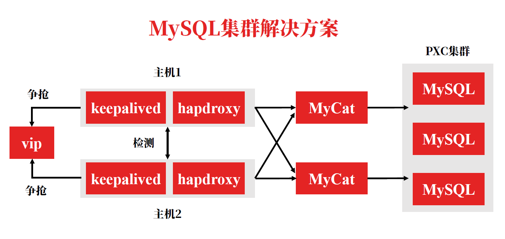

# MySQL集群思路

* 搭建2个三节点的pxc集群，分片1和分片2。

* 利用mycat中间件，实现数据切分，根据不同的路由算法方法SQL语句形成数据切分。
* 利用haproxy中间件，实现负载均衡，提供请求转发，降低单节点的负载。

在使用过程中根据功能分工，MySQL需要大量集群，mycat需要少量集群，haproxy不需要集群。

配置两个haproxy实现高可用，通过keepalived争抢虚拟ip（vip）实现双击热备。