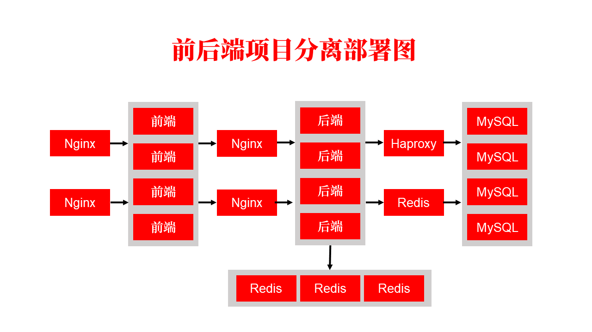

# docker前后端分离项目部署



## 一、后端项目部署

### 1、启动项目

> 利用java容器启动jar包

* 创建数据卷，并上传jar包

```shell
docker volume create j1
```

* 启动容器

```shell
docker run -d -it -v j1:/home/soft --name j1 --net=host java bash
```

* 进入容器，启动项目

```shell
docker exec -it j1 bash
cd /home/soft
nohup java -jar renren-fast.jar
```

### 2、利用nginx实现负载均衡

> 在pxc集群进行负载均衡时，我们采用的时haproxy，因为percona官方推荐，并且haproxy对TCP/IP有很好的支持；
>
> 在对tomcat服务器进行负载均衡的时候我们采用nginx，nginx对http的支持很好。

> 查看[docker hub](https://hub.docker.com/_/nginx)中nginx介绍。

* 根据配置文件启动nginx

```shell
docker run -d --name n1 -v /home/n1/nginx.conf:/etc/nginx/nginx.conf --net=host --privileged nginx
```

* 配置文件(官方文档复杂，来自其他途径)

```shell
user  nginx;
worker_processes  1;
error_log  /var/log/nginx/error.log warn;
pid        /var/run/nginx.pid;

events {
    worker_connections  1024;
}

http {
    include       /etc/nginx/mime.types;
    default_type  application/octet-stream;

    log_format  main  '$remote_addr - $remote_user [$time_local] "$request" '
                      '$status $body_bytes_sent "$http_referer" '
                      '"$http_user_agent" "$http_x_forwarded_for"';

    access_log  /var/log/nginx/access.log  main;

    sendfile        on;
    #tcp_nopush     on;

    keepalive_timeout  65;

    #gzip  on;

	proxy_redirect          off;
	proxy_set_header        Host $host;
	proxy_set_header        X-Real-IP $remote_addr;
	proxy_set_header        X-Forwarded-For $proxy_add_x_forwarded_for;
	client_max_body_size    10m;
	client_body_buffer_size   128k;
	proxy_connect_timeout   5s;
	proxy_send_timeout      5s;
	proxy_read_timeout      5s;
	proxy_buffer_size        4k;
	proxy_buffers           4 32k;
	proxy_busy_buffers_size  64k;
	proxy_temp_file_write_size 64k;

	upstream tomcat {
		server 192.168.36.111:6001;
		server 192.168.36.111:6002;
		server 192.168.36.111:6003;
	}
	server {
        listen       6101;
        server_name  192.168.36.111;
        location / {
            proxy_pass   http://tomcat;
            index  index.html index.htm;
        }
    }
}
```

### 3、keepalived实现双机热备

* 启动第二个nginx
* 分别进入nginx，安装启动keepalived
* 编辑keepalived配置文件，`/etc/keepalived/keepalived.conf`

```shell
vrrp_instance VI_1 {
    state MASTER
    interface ens33
    virtual_router_id 51
    priority 100
    advert_int 1
    authentication {
        auth_type PASS
        auth_pass 123456
    }
    virtual_ipaddress {
        192.168.36.121
    }
}
virtual_server 192.168.36.121 6201 {
    delay_loop 3
    lb_algo rr
    lb_kind NAT
    persistence_timeout 50
    protocol TCP
    real_server 192.168.36.111 6101 {
        weight 1
    }
}
```

* 启动keepalived

```shell
service keepalived start
```


## 二、前端项目部署

### 1、前端项目打包

* 更改[淘宝NPM镜像](https://npm.taobao.org/)

```shell
npm install -g cnpm --registry=https://registry.npm.taobao.org
```

* 执行webpack打包项目

```shell
cnpm run build
```

### `2、未完成`