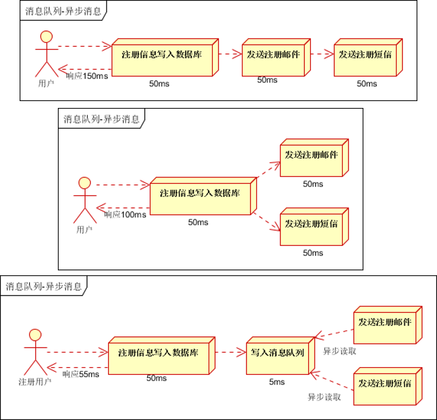
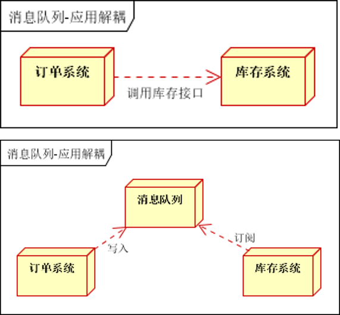
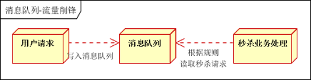

# 消息

> 对于大多数应用，可以通过消息服务中间件来提升系统的异步通信、扩展解耦能力。

1. **消息队列的三种使用场景**

2. **消息服务中的两个重要概念**

   `消息代理（message broker）`和`目的地（destination）`。消息发送者发送消息以后，将由消息代理接管，消息代理保证消息传递到制定的目的地。

3. **消息队列两种主要形式的目的地**
   
   * 队列（queue）：==点对点(point-to-point)==消息通信
   * 主题（topic）：==发布（publish）/订阅者（subscribe）==消息通信
4. JMS（java message service）java消息服务

   基于JVM消息代理的规范，activemq是JMS实现。

5. AMQP（advanced message queuing protocol）高级队列协议。

   RabbitMQ就是AMQP的实现
