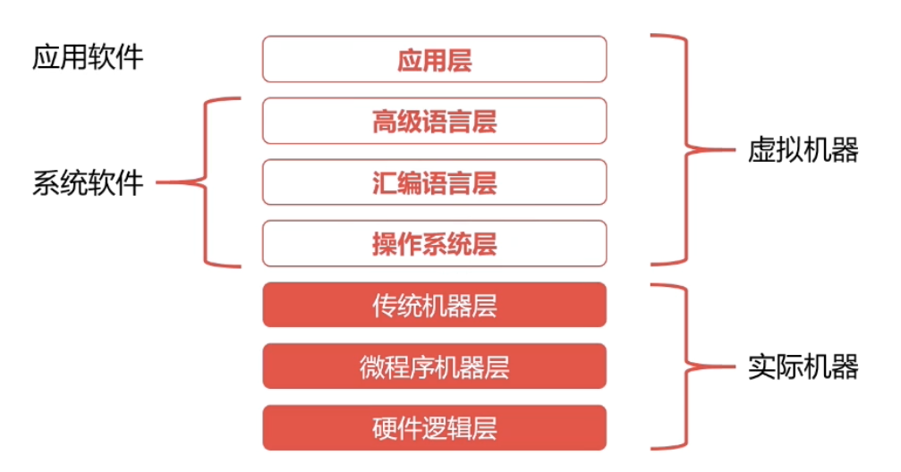

# 计算机组成原理

> 内容根据慕课网——[计算机基础](https://coding.imooc.com/class/chapter/355.html)

## 第一章、基础知识

### 1.1 计算机的体系与结构

#### 1、冯诺依曼体系

冯诺依曼体系就是`将程序指令和数据一起存储的计算机设计概念结构`。

冯诺依曼体系的特点：

* 能够把需要的程序和数据送至计算机中
* 能够长期记忆程序、数据、中间结果和最终运算结果的能力
* 能够具备算术、逻辑运算和数据传送等数据加工处理能力
* 能够将要求将结果输出显示给用户

冯诺依曼体系设计：

* CPU = 运算器 + 控制器
* 存储器独立于CPU

冯诺依曼体系的瓶颈：CPU处理速度块，存储器速率慢，CPU经常空转等待数据传输。

#### 2、现代计算机的结构

为解决冯诺依曼体系出现的瓶颈，现代计算机采用：

* CPU = 运算器 + 控制器 + 存储器

的设计思路，采用`CPU的寄存器、内存`这些更加高速的存储设备。现代计算机的结构可以理解为以存储为核心。

### 1.2 计算机的语言转换过程

计算机的语言转换过程分为：程序翻译和程序解释。

例如：计算机执行的语言为L0、编写的语言为L1

* 程序翻译的过程会生成新的L0程序，解释程序过程不生产新的L0程序
* 程序解释过程中有L0编写的解析器去解析L1程序

对于Java语言，采用的是`翻译 + 解释`过程：

* Java程序 -->(编译) JVM字节码 -->(解释) --> 机器码 

### 1.3 计算机的层次

* 传统机器层：编译语言是CPU指令集（机器指令），不同架构的CPU使用不同的CPU指令集。
* 操作系统层：
  * 向上提供了建议的操作界面
  * 向下对接了指令系统，管理硬件资源
  * 操作系统层是在软件和硬件之间的适配层
* 汇编语言层：汇编语言可以翻译成直接执行的机器语言，完成翻译过程的程序就是汇编器。

### 1.4 计算机的速度单位

#### 1、计算机的容量单位

1Byte = 8 bit ，其他单位(KB千字节、MB兆字节)的换算都是按照1024（2^10）计算

#### 2、计算机的网络速度

网络常用的单位为（Mpbs）

* 100M/s = 100 M/pbs = 100Mbit/s
* 100Mbit/s = (100/8)MB/s = 12.5MB/s

#### 3、计算机的CPU速度

Hz其实就是秒分之一，它是每秒中的周期性变动重复次数的计量。

* 2GHz = 2 * 1000^3 Hz --> 每秒20亿次

## 第二章、计算机组成

### 2.1 计算机的总线

总线用于`解决不同设备之间的通信问题`。总线分为片内总线、系统总线（数据总线、地址总线、控制总线）。

* 片内总线
  * 芯片内部的总线
  * 寄存器与寄存器、控制器、运算器之间
* 系统总线
  * 数据总线
  * 地址总线
  * 控制总线

为解决总线使用权的冲突问题，总线之间存在仲裁方法。

### 2.2 计算机的输入输出设备

由于CPU速度与IO设备速度不一致，CPU与IO设备的通信主要有两种方法：`程序终端`和`DMA（直接存储器访问）。`

`程序中断：`是指当外围IO设备就绪时，向CPU发出中断信号。

`DMA（直接存储器访问）：`DMA连接主存与IO设备，当主存与IO设备交换信息时，不需要中断CPU。提高CPU的效率。

### 2.3 计算机的存储系统

存储器的层次结构：`CPU、高速缓存、主存和辅存`。

局部性原理：局部性原理是指CPU访问存储器是，无论是存取指令还是存取数据，所访问的存器单元都`趋于聚焦在一个较小的连续区域中`。也就是说：只需要把程序经常访问的内存置换至缓存即可。

主存储器：RAM（随机存取存储器：Random Access Memory）

32位的操作系统，最大可用RAM为2^32^ = 4 * 2^30^ = 4GB，也就是对32位的操作系统，再大的内存也没有用。

### ......

## 第三章 计算机计算

二进制`源码`、`补码`和`反码`：

正数的源码、补码和反码一致。

负数的反码等于源码除符号位外按位取反；负数的补码等于反码+1。